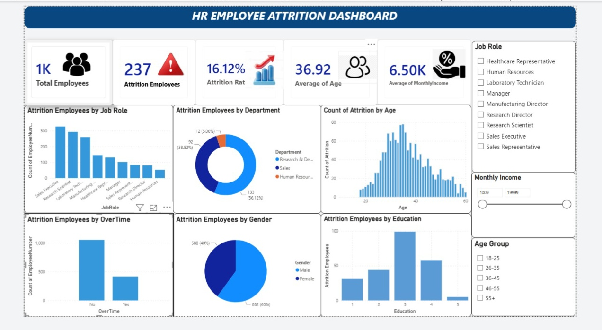

# HR Employee Attrition Dashboard

## 📊 Project Overview

This project is an **HR Employee Attrition Analysis Dashboard** developed using **Microsoft Power BI**.

The dashboard analyzes employee attrition patterns based on job role, department, age, overtime, gender, education, and monthly income. It helps HR teams understand workforce trends and identify areas where employee attrition is higher.

## 🎯 Objectives

- Analyze employee attrition patterns.
- Identify job roles with higher employee attrition.
- Compare attrition across different departments.
- Analyze attrition based on age and gender.
- Understand the impact of overtime on employee attrition.
- Analyze attrition based on education level.
- Provide interactive filters for HR analysis.

## 📌 Dashboard Features

- Total Employees KPI
- Attrition Employees KPI
- Attrition Rate KPI
- Average Employee Age
- Average Monthly Income
- Attrition by Job Role
- Attrition by Department
- Attrition by Age
- Attrition by Overtime
- Attrition by Gender
- Attrition by Education
- Interactive Job Role filter
- Monthly Income filter
- Age Group filter

## 🛠️ Tools & Technologies

- Microsoft Power BI
- DAX
- Data Visualization
- Data Analysis

## 📈 Key Insights

- The dashboard identifies employee attrition patterns across different job roles.
- Department-wise attrition can be compared using interactive visualizations.
- Age distribution helps identify employee groups with higher attrition.
- Overtime-wise attrition patterns can be analyzed.
- Gender-wise attrition provides workforce insights.
- Education-wise attrition provides additional HR insights.

## 🖼️ Dashboard Preview

## 📂 Project Files

- `HR-Employee-Attrition-Dashboard.jpeg` — Dashboard screenshot
- `README.md` — Project documentation

## 💡 Conclusion

This project demonstrates how **Power BI** can be used to transform HR employee data into meaningful visual insights. The dashboard provides an interactive way to analyze employee attrition and supports data-driven workforce analysis.

## 👩‍💻 Author

**Jayashree**# HR-Employee-Attrition-Dashboard
HR Employee Attrition analysis Dashboard using Power Bi
